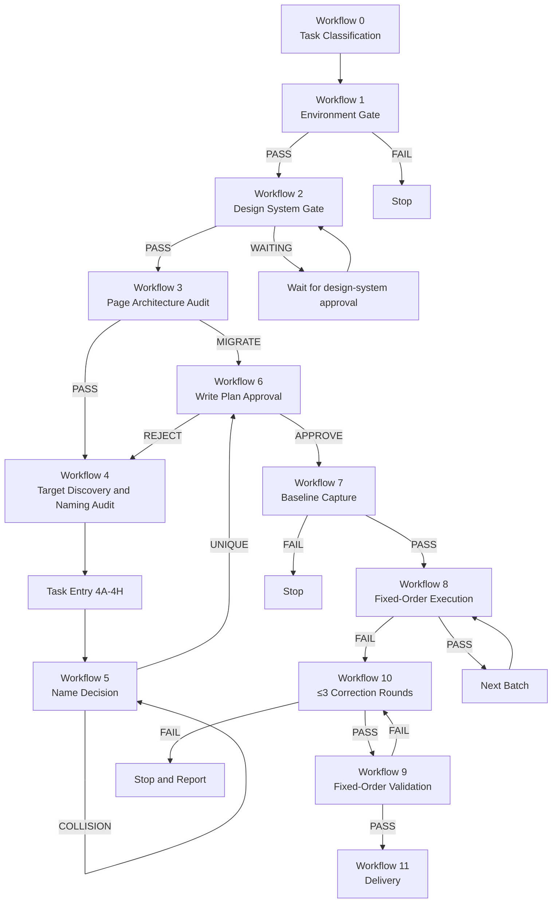
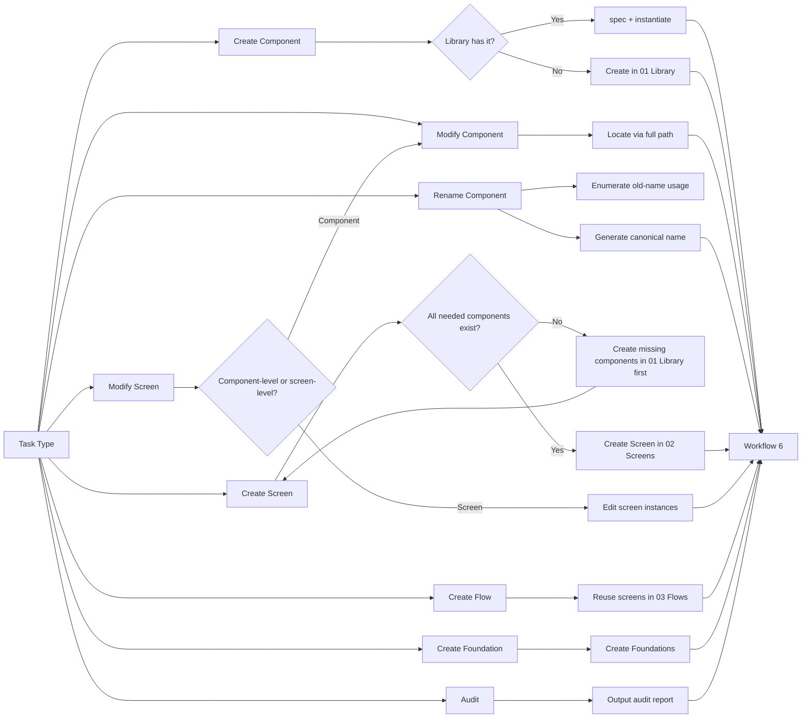
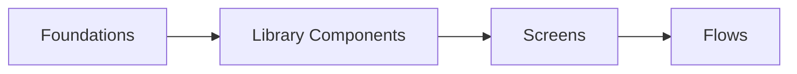
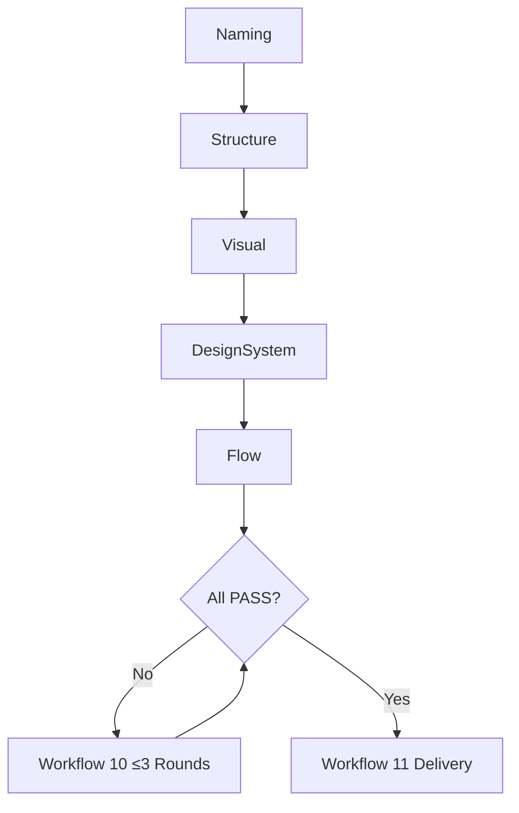
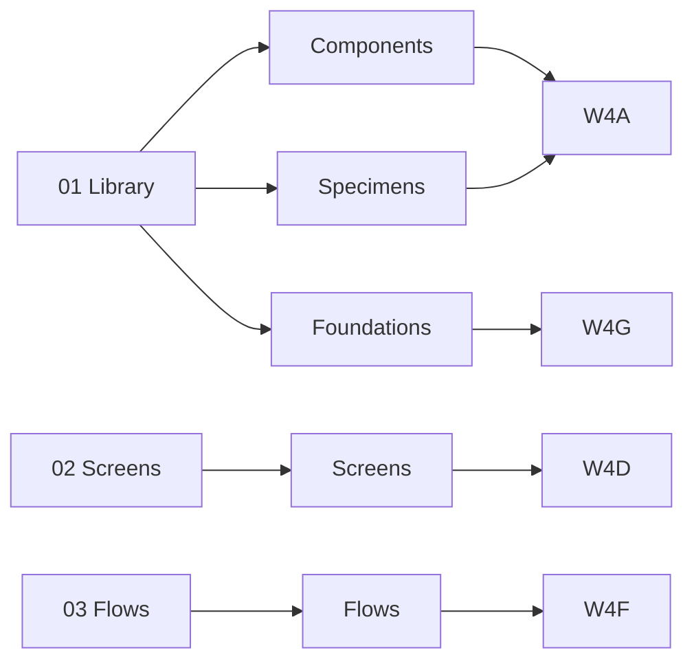

# `figma-skill` Naming and Workflow Upgrade Plan

> **For agentic workers:** REQUIRED SUB-SKILL: Use superpowers:executing-plans to implement this plan task-by-task in the current session. Steps use checkbox (`- [ ]`) syntax for tracking.

**Goal:** Upgrade `figma-skill` from `1.0` to `1.1` so its `SKILL.md` directly carries the complete component and Screen naming grammar, the deterministic Workflow 0–11 with task-entry subworkflows 4A–4H, and the Mermaid graphs required by the approved spec.

**Architecture:** Treat `SKILL.md` as the single source of behavioral truth for naming and workflow. Existing reference files stay; the current `tests/validate-skill.mjs` is extended with new deterministic assertions, and a parallel `tests/naming-and-workflow.test.mjs` covers the new content. No new `references/naming.md` is introduced; the spec's revised mapping holds.

**Tech Stack:** Markdown Agent Skills, Node.js `node:test`, existing PowerShell fixture tests, `figma-cli` 2.x reference only.

## Global Constraints

- Source of truth is `D:\ai-skills`; never write into `~/.claude/skills` or `~/.codex/skills`.
- Target skill version is `1.1`. Frontmatter `version` must equal `1.1` after the upgrade.
- All naming rules from `docs/superpowers/specs/2026-07-12-figma-skill-naming-and-workflow-design.md` Sections 1–5 live inside `figma-skill/SKILL.md`; do not create `figma-skill/references/naming.md`.
- All hard constraints in `SKILL.md` use "必须 / 禁止 / 只有……才允许 / ≤3".
- The five Mermaid graphs defined in spec Sections 7.1–7.5 must appear verbatim in `SKILL.md`.
- All approval, environment, re-read, cache, and three-round correction rules from `figma-skill` 1.0 must remain in effect.
- Every modification task ends with verification, `git add -A`, a meaningful commit, and `git push origin main`.
- The plan must remain implementable without spawning subagents; tests are deterministic and the agent-driven behavior repetition in Task 1 of the 1.0 plan is no longer required.

---

## File Map

### Modify

- `figma-skill/SKILL.md` — frontmatter version `1.0 → 1.1`; add Naming Grammar sections (Component, Screen, Specimen, Flow), add Workflow 0–11 with fixed inputs/outputs/gates/next states, add the five Mermaid graphs, strengthen Red Flags with the five new entries.
- `figma-skill/tests/validate-skill.mjs` — extend to require Workflow 0–11 markers and all five graph headings in `SKILL.md`.
- `figma-skill/tests/scenarios.md` — append scenario markers S9 (component naming collision) and S10 (screen identity with State/Viewport/Role).
- `figma-skill/tests/expected-behaviors.md` — extend the table with S9 and S10 rows.

### Create

- `figma-skill/tests/naming-and-workflow.test.mjs` — deterministic Node test that verifies every spec marker for naming grammar, Workflow 0–11, graph headings, and forbidden-word rules is present in `SKILL.md`.
- `figma-skill/tests/naming-results.md` — records how each naming/Workflow marker is satisfied by the rewritten `SKILL.md`, with file:line citations. This replaces the RED/GREEN agent behavior logs from the 1.0 plan; deterministic coverage is the documented gate.
- `docs/superpowers/plans/2026-07-12-figma-skill-naming-and-workflow-upgrade.md` — this plan file (already saved at execution start).

### Not created

- `figma-skill/references/naming.md` — explicitly excluded per spec revision.

---

### Task 1: Extend the Deterministic Skill Validator

**Files:**
- Modify: `figma-skill/tests/validate-skill.mjs`
- Read: `figma-skill/SKILL.md` (already exists at 1.0)

**Interfaces:**
- Consumes: existing `validate-skill.mjs` S1–S8 rule coverage assertions.
- Produces: a new exported function `assertNamingAndWorkflow(skill, runtimeMarkdown)` that the existing harness calls.

- [ ] **Step 1: Open the file and locate the closing `console.log` line**

Open `figma-skill/tests/validate-skill.mjs` and find the final `console.log(...)` statement.

- [ ] **Step 2: Insert the new function before the `console.log`**

Insert this block immediately above the final `console.log`:

```javascript
function assertNamingAndWorkflow(skill, runtimeMarkdown) {
  // Naming grammar markers (Sections 1-5 of the spec).
  for (const phrase of [
    /<Category>\/<Domain>\/<Component>\[?\/<Part>\.\.\.\]?\/?/,
    "Screen/<Platform>/<Domain>/<Flow>/<View>",
    "State=<State>",
    "Viewport=<Viewport>",
    "Role=<Role>",
    "Specimen/StateGallery",
    "Specimen/VariantMatrix",
    "Specimen/Properties",
    "Specimen/Usage",
    "Foundation",
    "Primitive",
    "Action",
    "Input",
    "Navigation",
    "DataDisplay",
    "Feedback",
    "Overlay",
    "Layout",
    "Content",
    "Internal",
    "Deprecated",
    "Variant",
    "Platform",
    "Size",
    "State",
    "Validation",
    "Selection",
    "Orientation",
    "Density",
    "Expanded",
    "Loading",
    "True",
    "False",
    "01 Library",
    "02 Screens",
    "03 Flows",
    "00 Foundations",
    "10 Components",
    "80 Internal",
    "90 Deprecated",
  ]) {
    if (phrase instanceof RegExp) {
      assert.match(skill, phrase, `naming marker missing: ${phrase}`);
    } else {
      assert.ok(skill.includes(phrase), `naming marker missing: ${phrase}`);
    }
  }

  // Workflow 0-11 markers.
  for (const workflow of [
    "Workflow 0",
    "Workflow 1",
    "Workflow 2",
    "Workflow 3",
    "Workflow 4",
    "Workflow 4A",
    "Workflow 4B",
    "Workflow 4C",
    "Workflow 4D",
    "Workflow 4E",
    "Workflow 4F",
    "Workflow 4G",
    "Workflow 4H",
    "Workflow 5",
    "Workflow 6",
    "Workflow 7",
    "Workflow 8",
    "Workflow 9",
    "Workflow 10",
    "Workflow 11",
  ]) {
    assert.ok(skill.includes(workflow), `workflow marker missing: ${workflow}`);
  }

  // Five required Mermaid graphs.
  for (const graph of [
    "Total Workflow Graph",
    "Task Entry and Reuse Graph",
    "Single-Direction Dependency Graph",
    "Validation Order Graph",
    "Page Architecture Graph",
  ]) {
    assert.ok(skill.includes(graph), `graph heading missing: ${graph}`);
  }

  // Forbidden-word negatives (re-asserted to catch regressions).
  for (const bad of ["Common", "General", "Misc", "Other"]) {
    const re = new RegExp(`^\\s*-\\s*${bad}\\s*$`, "m");
    assert.ok(!skill.match(re), `forbidden bucket listed as a category: ${bad}`);
  }

  assert.doesNotMatch(skill, /find the master by instance name/);
  assert.match(skill, /Workflow 0/);
}
```

- [ ] **Step 3: Call the new function inside the existing harness**

Replace the existing final `console.log("PASS: ...")` with:

```javascript
assertNamingAndWorkflow(skill, runtimeMarkdown);
console.log("PASS: figma-skill structure, wording, S1-S8 rule coverage, and naming + workflow markers");
```

- [ ] **Step 4: Run the validator and confirm RED**

Run:

```bash
node figma-skill/tests/validate-skill.mjs
```

Expected: FAIL with `assert.ok(skill.includes(phrase))` messages naming every missing marker (naming grammar, workflow titles, graph headings). At minimum the workflow and graph headings must be reported.

- [ ] **Step 5: Commit the failing test**

```bash
git add figma-skill/tests/validate-skill.mjs
git commit -m "test(figma-skill): require naming and workflow markers"
```

Do not push yet. Subsequent tasks will be pushed together.

---

### Task 2: Create the Dedicated Naming and Workflow Test

**Files:**
- Create: `figma-skill/tests/naming-and-workflow.test.mjs`

**Interfaces:**
- Consumes: `SKILL.md` text from the working tree.
- Produces: an independent `node:test` module that mirrors the new assertions, so both `validate-skill.mjs` and `node --test` fail with clear evidence before the rewrite.

- [ ] **Step 1: Write the failing test file**

Create `figma-skill/tests/naming-and-workflow.test.mjs`:

```javascript
import assert from "node:assert/strict";
import { readFileSync } from "node:fs";
import { fileURLToPath } from "node:url";
import { dirname, join } from "node:path";
import { test } from "node:test";

const root = join(dirname(fileURLToPath(import.meta.url)), "..");
const skill = readFileSync(join(root, "SKILL.md"), "utf8");

function includesAny(haystack, needles) {
  return needles.some((n) => haystack.includes(n));
}

test("SKILL.md declares the three-page architecture", () => {
  assert.ok(includesAny(skill, ["01 Library", "02 Screens", "03 Flows"]));
});

test("SKILL.md includes the five Mermaid graph headings", () => {
  for (const heading of [
    "Total Workflow Graph",
    "Task Entry and Reuse Graph",
    "Single-Direction Dependency Graph",
    "Validation Order Graph",
    "Page Architecture Graph",
  ]) {
    assert.ok(skill.includes(heading), `missing heading: ${heading}`);
  }
});

test("SKILL.md references every Workflow 0..11 and entry 4A..4H", () => {
  const required = [
    "Workflow 0",
    "Workflow 1",
    "Workflow 2",
    "Workflow 3",
    "Workflow 4",
    "Workflow 4A",
    "Workflow 4B",
    "Workflow 4C",
    "Workflow 4D",
    "Workflow 4E",
    "Workflow 4F",
    "Workflow 4G",
    "Workflow 4H",
    "Workflow 5",
    "Workflow 6",
    "Workflow 7",
    "Workflow 8",
    "Workflow 9",
    "Workflow 10",
    "Workflow 11",
  ];
  for (const id of required) {
    assert.ok(skill.includes(id), `missing workflow: ${id}`);
  }
});

test("SKILL.md lists all fixed base categories", () => {
  for (const category of [
    "Foundation",
    "Primitive",
    "Action",
    "Input",
    "Navigation",
    "DataDisplay",
    "Feedback",
    "Overlay",
    "Layout",
    "Content",
    "Internal",
    "Deprecated",
  ]) {
    assert.ok(skill.includes(category), `missing category: ${category}`);
  }
});

test("SKILL.md lists all Variant axes", () => {
  for (const axis of [
    "Variant",
    "Platform",
    "Size",
    "State",
    "Validation",
    "Selection",
    "Orientation",
    "Density",
    "Expanded",
    "Loading",
  ]) {
    assert.ok(skill.includes(axis), `missing axis: ${axis}`);
  }
});

test("SKILL.md forbids placeholder bucket categories", () => {
  for (const bad of ["Common", "General", "Misc", "Other"]) {
    const re = new RegExp(`^\\s*-\\s*${bad}\\s*$`, "m");
    assert.ok(!skill.match(re), `forbidden bucket listed: ${bad}`);
  }
});

test("SKILL.md uses mandatory wording tokens", () => {
  for (const phrase of ["必须", "禁止", "只有", "≤3"]) {
    assert.ok(skill.includes(phrase), `missing mandatory wording: ${phrase}`);
  }
});
```

- [ ] **Step 2: Run the test and confirm RED**

Run:

```bash
node --test figma-skill/tests/naming-and-workflow.test.mjs
```

Expected: FAIL because the current 1.0 `SKILL.md` lacks the workflow indices, graph headings, base categories, and Variant axes.

- [ ] **Step 3: Commit the failing test**

```bash
git add figma-skill/tests/naming-and-workflow.test.mjs
git commit -m "test(figma-skill): cover naming grammar and workflow 0-11"
```

Do not push yet.

---

### Task 3: Extend the Behavior Scenarios for Naming

**Files:**
- Modify: `figma-skill/tests/scenarios.md`
- Modify: `figma-skill/tests/expected-behaviors.md`

**Interfaces:**
- Consumes: existing eight scenarios S1–S8.
- Produces: S9 (component naming collision) and S10 (screen identity with controlled dimensions), each anchored to a mandatory evidence marker the deterministic tests check for.

- [ ] **Step 1: Append S9 and S10 to scenarios.md**

Open `figma-skill/tests/scenarios.md` and append after the S8 block:

```markdown
## S9 — Component naming collision
A Component Set `Window/TitleBar` already exists for both Windows and macOS, and they are interchangeable in the same layout. A new request asks to add a Linux version with slightly different controls.
A) Create a third top-level component named `LinuxTitleBar` alongside the existing set.
B) Extend the existing `Window/TitleBar` Component Set with a `Platform=Linux` variant.
C) Create a new component `Platform/Linux/Window/TitleBar` parallel to the existing set.

## S10 — Screen identity with State, Viewport, and Role
The target is a checkout payment screen. Default state, mobile viewport, and an admin role see additional audit fields. Other states are defined but not in this task.
A) Create one Frame named `Screen/Web/Commerce/Checkout/Payment` and edit instances per scenario.
B) Create one Frame per state/viewport combination the team has ever asked about, named by inline descriptions.
C) Create `Screen/Web/Commerce/Checkout/Payment/State=Default/Viewport=Mobile/Role=Admin` plus minimal additional combinations and report the rest as out-of-scope.
```

- [ ] **Step 2: Add the scoring rows to expected-behaviors.md**

Append these rows to the table in `figma-skill/tests/expected-behaviors.md`:

```markdown
| S9  | B | one Component Set with Platform variant; no parallel component |
| S10 | C | full path with State/Viewport/Role; report missing combinations |
```

- [ ] **Step 3: Verify the markers are now in the file**

Run:

```bash
grep -F "S9 — Component naming collision" figma-skill/tests/scenarios.md
grep -F "S10 — Screen identity with State, Viewport, and Role" figma-skill/tests/scenarios.md
grep -F "| S9  | B" figma-skill/tests/expected-behaviors.md
grep -F "| S10 | C" figma-skill/tests/expected-behaviors.md
```

Expected: each command exits `0`.

- [ ] **Step 4: Commit the scenario extension**

```bash
git add figma-skill/tests/scenarios.md figma-skill/tests/expected-behaviors.md
git commit -m "test(figma-skill): add naming collision and screen identity scenarios"
```

Do not push yet.

---

### Task 4: Rewrite `SKILL.md` to 1.1

**Files:**
- Modify: `figma-skill/SKILL.md`

**Interfaces:**
- Consumes: the 1.0 file structure and the naming/workflow spec sections.
- Produces: a single `SKILL.md` with frontmatter `version: 1.1` and the full naming grammar, Workflow 0–11, and five Mermaid graphs.

- [ ] **Step 1: Replace the frontmatter version**

In `figma-skill/SKILL.md`, change `version: 1.0` to `version: 1.1`. Save nothing else here yet.

- [ ] **Step 2: Replace the body with the full 1.1 content**

Overwrite `figma-skill/SKILL.md` body with the following content, preserving the YAML frontmatter from Step 1:

```markdown
# Figma End-to-End Execution

将用户需求转化为可编辑、可复用、经过实际截图验收的 Figma 产品 UI。覆盖从零创建与修改现有文件。首版聚焦 Web、桌面端、移动端 UI 及设计系统。

## Non-Negotiable Rules

- 所有 Figma 读取、创建、修改、导出和验证必须使用 `figma-cli`。
- 禁止使用 Figma MCP、其他 Figma CLI 或 GUI 自动化作为替代路径。
- 每个新会话首次执行 Figma 任务时，必须先运行 `figma-cli connect`，再运行 `figma-cli status`。
- `<Current workspace>/docs/FIGMA_DESIGN_SYSTEM.md` 是唯一设计规范来源。
- 设计系统审批与 Figma 首次写入审批是两次独立审批；前者禁止被解释为后者。
- 只有当前 CLI 顶层帮助和最接近意图的子命令帮助都证明缺少原生能力，并且用户批准该精确降级时，才允许使用 `eval/run`。
- duplicate、reparent、unwrap、组件化、组合 variants、删除重建或大幅层级调整后，必须重新读取 NodeId 和当前几何。
- 首版禁止创建跨任务持久缓存。任务内上下文禁止替代写入前实时读取。
- 验证失败最多自动修正三轮（≤3）；仍失败必须停止写入并完整报告。
- 硬性要求必须用「必须」「禁止」「只有……才允许」；禁止用弱措辞稀释门禁。

## Naming Grammar

### Component Path

```text
<Category>/<Domain>/<Component>[/<Part>...]
```

完整路径在同一个 Figma 文件中必须唯一。路径只表达稳定身份；禁止使用颜色、尺寸、状态或版本修饰。

固定基础分类：

```text
Foundation
Primitive
Action
Input
Navigation
DataDisplay
Feedback
Overlay
Layout
Content
Internal
Deprecated
```

项目可在 `FIGMA_DESIGN_SYSTEM.md` 增加业务域分类，但必须说明用途并禁止使用 `Common` / `General` / `Misc` / `Other` 等兜底目录。

### Screen Path

```text
Screen/<Platform>/<Domain>/<Flow>/<View>
  /State=<State>
  /Viewport=<Viewport>
  /Role=<Role>
```

示例：

```text
Screen/Web/Commerce/Checkout/Payment
Screen/Web/Commerce/Checkout/Payment/State=Error/Viewport=Mobile
Screen/Web/Workspace/Dashboard/Overview/Role=Admin
```

State、Viewport、Role 之间必须相互独立，禁止把多个维度合并到同一个值。

### Specimen Path

```text
Specimen/StateGallery
Specimen/VariantMatrix
Specimen/Properties
Specimen/Usage
```

### Flow Path

```text
Flow/<Domain>/<Flow>
```

### Collision Resolution

```text
能否在相同位置、以相同职责直接互换？
├── 是 → 同一 Component Set，以独立 Variant Property 区分
└── 否 → 独立组件，以完整语义路径区分
```

### Variant Axes

```text
Variant
Platform
Size
State
Validation
Selection
Orientation
Density
Expanded
Loading
```

标准 State 值：

```text
State=Default
State=Hover
State=Pressed
State=Focused
State=Disabled
```

属性名和值统一英文 PascalCase。布尔属性统一使用 `True` / `False`。

禁止：

```text
State=PrimaryMediumHoverLoading
State=MacOSDarkInactive
Validation=SelectedErrorDisabled
```

### Instance Naming

主组件保持规范完整路径；实例按在页面内的角色命名（例如 `PrimaryNavigation`）。禁止从实例名称猜测主组件来源，CLI 必须按主组件完整路径查找。

## Three-Page Architecture (Free Figma Plan)

```text
01 Library
02 Screens
03 Flows
```

禁止创建第四个 Page。`01 Library` 内部必须按 Section 分区：

```text
01 Library
├── Section: 00 Foundations
├── Section Group: 10 Components
├── Section: 80 Internal
└── Section: 90 Deprecated
```

`02 Screens` 通过业务域和 Flow Section 组织；`03 Flows` 只承载流程编排，不承载权威 Component 或 Screen。

## State Machine

```text
接收需求
→ Workflow 0 任务分类
→ Workflow 1 工作区与环境门禁
→ Workflow 2 设计系统门禁
→ Workflow 3 Figma 文件结构审计
→ Workflow 4 目标发现与命名审计
→ Workflow 4A–4H 任务入口
→ Workflow 5 命名决策
→ Workflow 6 Figma 写入方案审批
→ Workflow 7 记录基线
→ Workflow 8 按固定顺序执行
→ Workflow 9 固定验证顺序
→ Workflow 10 最多三轮修正
→ Workflow 11 交付
```

## Approval Gates

### Gate 1 — Design System

文档缺失或缺少当前任务规则时，必须先提出最小必要规范，说明依据、影响和范围外冲突，并等待明确批准。批准后才允许写入 Markdown。该批准禁止授权任何 Figma 写入。

### Gate 2 — Figma Write

设计系统确定后，必须提交目标范围、复用/创建策略、组件与变量改动、布局与响应式方案、冲突修正范围、基线与批次、`eval/run` 证据、验证标准，并等待明确批准。结构、规范、范围、共享组件或降级方式实质变化时，必须重新审批。

## Workflows 0–11

### Workflow 0 — Task Classification

输出：`TaskType ∈ {A Create, B Modify, C Audit, D Migrate, E Export}`，`WriteRequired: True | False`。完成条件：分类与预期交付物明确；下一状态：Workflow 1。`WriteRequired=False` 时仍执行 1/2/3/4/9/11，禁止进入 5/6/7/8/10。

### Workflow 1 — Workspace and Environment

固定动作：固定 `<Current workspace>`；执行 `figma-cli --version`、`--help`、Windows 安装（必要时）；`connect`；`status`。完成条件：`EnvironmentGate=PASS`。下一状态：PASS → 2；FAIL → 停止。

### Workflow 2 — Design System Gate

固定动作：读取 `<Current workspace>/docs/FIGMA_DESIGN_SYSTEM.md`，按缺失、缺项、完整三分支处理。完成条件：`DesignSystemGate=PASS` 或 `WAITING_APPROVAL`。下一状态：PASS → 3；WAITING → 等待审批后回到 2。

### Workflow 3 — Page Architecture Audit

固定检查：`01 Library` / `02 Screens` / `03 Flows` 三个 Page；`00 Foundations` / `10 Components` / `80 Internal` / `90 Deprecated` Section；权威组件位置；权威 Screen 位置。完成条件：`PageArchitectureGate=PASS` 或 `NEEDS_MIGRATION`。下一状态：PASS → 4；NEEDS_MIGRATION + WriteRequired=True → 并入 Workflow 6；NEEDS_MIGRATION + WriteRequired=False → 仅记录。

### Workflow 4 — Target Discovery and Naming Audit

固定动作：定位 Page/Section/Frame/Component；读取相关 variables、styles、components、Component Sets 和 reuse handles；按完整规范路径查找；歧义时必须补全路径。完成条件：`DiscoveryGate=PASS`。下一状态：PASS → 4A–4H。

### Workflow 4A — Create Component

固定动作：在 `01 Library` 中只读检查是否已有匹配组件；不存在则按 Category 创建 Section；创建主组件或 Component Set；补齐 Variant Property；添加四个 Specimen。完成条件：组件和 Specimen 已就位。下一状态：Workflow 5。

### Workflow 4B — Modify Component

固定动作：通过 `spec` 读取完整定义；列出 specimens、Screen 实例、文档引用；估算影响半径。完成条件：影响半径已记录。下一状态：Workflow 5。

### Workflow 4C — Rename Component

固定动作：用旧名称枚举所有实例、引用、外部代码引用；生成新规范名称；估算影响。完成条件：迁移清单已记录。下一状态：Workflow 5。

### Workflow 4D — Create Screen

固定动作：复核 `01 Library` 是否已有所需组件；缺失则先在 Library 创建再返回；在 `02 Screens` 定位 Section；创建 Screen Frame；实例化所需组件；禁止在 Screen 中另存变体组件。完成条件：Screen 已创建并仅消费 Library 组件。下一状态：Workflow 5。

### Workflow 4E — Modify Screen

固定动作：定位 Screen；列出每个组件实例的来源；判断是组件级改动（→ 4B）还是内容级改动。完成条件：来源分类已记录。下一状态：Workflow 5 或 Workflow 4B。

### Workflow 4F — Create Flow

固定动作：复核 `02 Screens` 齐备；复用 Screen Frame；在 `03 Flows` 摆放或连线；禁止在 Flows 重新设计 Screen 源。完成条件：Flow 已创建。下一状态：Workflow 5。

### Workflow 4G — Create Foundation

固定动作：先更新 `FIGMA_DESIGN_SYSTEM.md`；获批后在 `01 Library/00 Foundations` 创建。完成条件：文档已批准，Foundations 已创建。下一状态：Workflow 5。

### Workflow 4H — Audit

固定动作：只读检查 Pages、命名、验证；输出报告；禁止修改。完成条件：报告已生成。下一状态：Workflow 9。

### Workflow 5 — Name Decision

输出：`ObjectType`、`CanonicalName`、`VariantAxes`、`PropertyNames`、`NameUnique`。`NameUnique=False` 必须重新生成完整语义路径，禁止使用 `2` / `Copy` / `New` / `Final` / `V2`。完成条件：唯一名称。下一状态：Workflow 6。

### Workflow 6 — Figma Write Plan Approval

固定模板：

```text
TargetFile:
TargetPage:
TargetSection:
TaskBoundary:
Create:
Modify:
Rename:
Reuse:
Instantiate:
Duplicate:
Variables:
Components:
Screens:
Flows:
PageMigration:
NamingMigration:
AffectedDependencies:
OutOfScopeIssues:
CommandPlan:
EvalRunFallback:
BaselinePlan:
ValidationPlan:
```

`EvalRunFallback` 必须包含 `NativeHelpChecked`、`MissingNativeCapability`、`TargetNodeIds`、`FallbackCodeScope`、`FallbackImpact`。完成条件：获得用户明确批准。下一状态：批准 → 7；拒绝 → 回到 4；范围实质变化 → 重新审批。

### Workflow 7 — Baseline Capture

记录目标及直接依赖的 NodeId、name、type、parent、位置与尺寸、Auto Layout、约束、绑定、reuse handles、基线截图。重命名任务还需记录旧名称、新名称、已有实例、文档引用、替换路径。完成条件：`BaselineGate=PASS`。下一状态：Workflow 8。

### Workflow 8 — Fixed-Order Execution

固定依赖顺序：`Foundations → Library Components → Variants/Properties → Specimens → Screens → Flows`。Screen 禁止在组件就绪前创建。每批：读 → 写 → 重读 → 检查 → 通过则下一批。结构变化后必须重读 NodeId。完成条件：所有批次 `BatchGate=PASS`。下一状态：完成 → Workflow 9；任一批次失败 → Workflow 10。

### Workflow 9 — Fixed-Order Validation

固定顺序：`Naming → Structure → Visual → DesignSystem → Flow`。Visual 必须实际打开 `[Current workspace>/temp/figma-screenshot/` 中的截图。完成条件：`ValidationGate=PASS`。下一状态：PASS → 11；FAIL → 10。

### Workflow 10 — At Most Three Correction Rounds

最多三轮：定位 → 最小修正 → 重跑受影响验证。第三轮后仍失败必须停止写入，禁止第四轮；输出完整失败报告。完成条件：第三轮内 PASS 或正式失败。下一状态：PASS → 9；失败 → 停止。

### Workflow 11 — Delivery

固定交付报告：

```text
TaskType:
DesignSystemChanges:
PageChanges:
ComponentsCreated:
ComponentsModified:
ComponentsRenamed:
ScreensCreated:
FlowsCreated:
OutOfScopeNamingIssues:
Validation:
- Naming:
- Structure:
- Visual:
- DesignSystem:
- Flow:
ScreenshotPaths:
RemainingIssues:
CorrectionRounds:
FinalStatus: PASS | FAILED
```

只有 `FinalStatus=PASS` 才允许声明完成。

## Diagrams

### Total Workflow Graph



### Task Entry and Reuse Graph



### Single-Direction Dependency Graph



反向路径禁止：`Screens -.-> Foundations`、`Flows -.-> Library Components`。

### Validation Order Graph



### Page Architecture Graph



## Reference Loading

按阶段只读取对应文件：

- 环境检查、Windows 安装、Yolo 连接：`references/installation.md`
- 设计系统文档、缺项、冲突和第一次审批：`references/design-system.md`
- 只读发现、任务内上下文、复用决策和第二次审批：`references/discovery-and-planning.md`
- 已批准写入、命令选择、NodeId、`eval/run` 和恢复：`references/execution.md`
- 三层验收、截图、修正循环与交付：`references/validation.md`

命名规则已写入 `SKILL.md` 本体，不再有独立的 `references/naming.md`。

## Red Flags — Stop

- “MCP 已连接，先用它更快。”
- “用户说不用打扰，所以缺失规范可直接用默认值。”
- “`eval` 仍属于 CLI，不必查原生命令。”
- “duplicate 后旧 ID 通常还能用。”
- “导出成功等于视觉正确。”
- “三轮后再试一次也许就好。”
- “先改 Figma，文档稍后补。”
- “跳过 `01 Library` 检查，Screen 不大。”
- “只重命名主组件，实例不动。”
- “为了整齐新增第四个 Page。”
- “把 Screen 当成组件变体。”
- “下一步该做什么？”——工作流已经定义下一状态。

## Rationalizations Observed in Baseline Tests

| 基线中的合理化 | 强制回应 |
|---|---|
| “MCP 已可用，安装 CLI 增加风险和延误。” | 必须从官方稳定 GitHub Release 安装并验证 `figma-cli`；失败即停止，禁止替代工具。 |
| “用户授权 sensible defaults 且不想被打扰。” | 权威文档缺少当前规则时，必须先补充最小规范并获得独立批准。用户的催促禁止跨越规范门禁。 |

## Completion Gate

只有同时满足以下条件才允许报告完成：

- 批准范围内写入已执行；
- 三层验证全部通过；
- 最终截图已实际打开检查并归档；
- 当前任务符合 `docs/FIGMA_DESIGN_SYSTEM.md`；
- 没有未披露的失败、范围变化或未经批准的降级；
- 三轮修正仍失败时已停止写入并给出完整失败报告；
- 命名与 Workflow 标记全部由确定性测试覆盖并通过。
```

- [ ] **Step 3: Run the validator suite and confirm GREEN**

Run:

```bash
node figma-skill/tests/validate-skill.mjs
node --test figma-skill/tests/naming-and-workflow.test.mjs
node --test figma-skill/tests/figma-validate-bounds.test.mjs
powershell -NoProfile -ExecutionPolicy Bypass -File figma-skill/tests/install-figma-cli.Tests.ps1
```

Expected: every command exits `0`.

- [ ] **Step 4: Commit the rewritten skill**

```bash
git add figma-skill/SKILL.md
git commit -m "feat(figma-skill): bake naming grammar and workflow 0-11 into SKILL.md"
```

---

### Task 5: Record Deterministic Coverage and Push

**Files:**
- Create: `figma-skill/tests/naming-results.md`

**Interfaces:**
- Consumes: the rewritten `SKILL.md`, `validate-skill.mjs`, and `naming-and-workflow.test.mjs`.
- Produces: a concise traceability record linking each spec marker to its file:line citation.

- [ ] **Step 1: Record traceability**

Create `figma-skill/tests/naming-results.md` with this content, replacing `XX` with the real line numbers obtained by `grep -n`:

```markdown
# Naming and Workflow Coverage

## Deterministic Tests

| Test                                               | Purpose                                       | Status |
|----------------------------------------------------|-----------------------------------------------|--------|
| `node figma-skill/tests/validate-skill.mjs`        | Structure, wording, S1-S8, naming + workflow | PASS   |
| `node --test figma-skill/tests/naming-and-workflow.test.mjs` | Dedicated naming/workflow coverage   | PASS   |
| `node --test figma-skill/tests/figma-validate-bounds.test.mjs` | Bounds auditor regression         | PASS   |
| `powershell figma-skill/tests/install-figma-cli.Tests.ps1` | Installer fixtures                  | PASS   |

## SKILL.md Coverage

### Naming Grammar (Spec Sections 1–5)

| Spec section | Implemented at | Marker |
|---|---|---|
| Section 1 — Language and Path Grammar | figma-skill/SKILL.md:XX | "English PascalCase", "<Category>/<Domain>/<Component>[/<Part>...]" |
| Section 2 — Fixed Base Categories | figma-skill/SKILL.md:XX | Foundation, Primitive, Action, Input, Navigation, DataDisplay, Feedback, Overlay, Layout, Content, Internal, Deprecated |
| Section 3 — Component Identity | figma-skill/SKILL.md:XX | "Collision Resolution", "Variant Axes" |
| Section 4 — Variants, Properties, Instances | figma-skill/SKILL.md:XX | "Variant Axes", "Instance Naming" |
| Section 5 — Screens, Flows, Page Architecture | figma-skill/SKILL.md:XX | "Screen Path", "Three-Page Architecture" |

### Workflows 0–11 (Spec Section 6)

| Workflow | Implemented at |
|---|---|
| Workflow 0 | figma-skill/SKILL.md:XX |
| Workflow 1 | figma-skill/SKILL.md:XX |
| Workflow 2 | figma-skill/SKILL.md:XX |
| Workflow 3 | figma-skill/SKILL.md:XX |
| Workflow 4 | figma-skill/SKILL.md:XX |
| Workflow 4A | figma-skill/SKILL.md:XX |
| Workflow 4B | figma-skill/SKILL.md:XX |
| Workflow 4C | figma-skill/SKILL.md:XX |
| Workflow 4D | figma-skill/SKILL.md:XX |
| Workflow 4E | figma-skill/SKILL.md:XX |
| Workflow 4F | figma-skill/SKILL.md:XX |
| Workflow 4G | figma-skill/SKILL.md:XX |
| Workflow 4H | figma-skill/SKILL.md:XX |
| Workflow 5 | figma-skill/SKILL.md:XX |
| Workflow 6 | figma-skill/SKILL.md:XX |
| Workflow 7 | figma-skill/SKILL.md:XX |
| Workflow 8 | figma-skill/SKILL.md:XX |
| Workflow 9 | figma-skill/SKILL.md:XX |
| Workflow 10 | figma-skill/SKILL.md:XX |
| Workflow 11 | figma-skill/SKILL.md:XX |

### Diagrams (Spec Section 7)

| Diagram | Implemented at |
|---|---|
| Total Workflow Graph | figma-skill/SKILL.md:XX |
| Task Entry and Reuse Graph | figma-skill/SKILL.md:XX |
| Single-Direction Dependency Graph | figma-skill/SKILL.md:XX |
| Validation Order Graph | figma-skill/SKILL.md:XX |
| Page Architecture Graph | figma-skill/SKILL.md:XX |

## Behavior Scenarios

| Scenario | Choice | Coverage by deterministic test |
|---|---|---|
| S1–S8 | B | `validate-skill.mjs` S1–S8 markers |
| S9 (component naming collision) | B | `naming-and-workflow.test.mjs` Variant axes and Collision Resolution markers |
| S10 (screen identity with State/Viewport/Role) | C | `naming-and-workflow.test.mjs` Screen Path markers |
```

- [ ] **Step 2: Replace `XX` placeholders with real line numbers**

Run:

```bash
for marker in 'English PascalCase' '<Category>/<Domain>/<Component>' Foundation Primitive Action Input Navigation DataDisplay Feedback Overlay Layout Content Internal Deprecated 'Variant Axes' 'Instance Naming' 'Screen Path' 'Three-Page Architecture' 'Total Workflow Graph' 'Task Entry and Reuse Graph' 'Single-Direction Dependency Graph' 'Validation Order Graph' 'Page Architecture Graph'; do printf '%s %s\n' "$(grep -nF "$marker" figma-skill/SKILL.md | head -1)" "$marker"; done
for wf in 0 1 2 3 4 5 6 7 8 9 10 11; do printf 'Workflow %s %s\n' "$wf" "$(grep -nF "Workflow $wf" figma-skill/SKILL.md | head -1)"; done
for wf in 4A 4B 4C 4D 4E 4F 4G 4H; do printf 'Workflow %s %s\n' "$wf" "$(grep -nF "Workflow $wf" figma-skill/SKILL.md | head -1)"; done
```

Use the line numbers to edit `naming-results.md`, replacing each `XX` after the corresponding marker with the actual line. Keep `XX` only on truly missing items and surface them in the final report.

- [ ] **Step 3: Run the full regression suite**

Run:

```bash
node figma-skill/tests/validate-skill.mjs
node --test figma-skill/tests/naming-and-workflow.test.mjs
node --test figma-skill/tests/figma-validate-bounds.test.mjs
powershell -NoProfile -ExecutionPolicy Bypass -File figma-skill/tests/install-figma-cli.Tests.ps1
powershell -NoProfile -ExecutionPolicy Bypass -File figma-skill/scripts/install-figma-cli.ps1 -PlanOnly
git diff --check
git status --short --branch
```

Expected: every command exits `0`; working tree shows only the rewrite and traceability additions.

- [ ] **Step 4: Commit and push the upgrade**

```bash
git add -A
git commit -m "feat(figma-skill): ship v1.1 naming grammar and workflow 0-11"
git push origin main
```

Expected: push succeeds; sync hook re-publishes `figma-skill` to both runtime roots (content identical when only docs changed).

- [ ] **Step 5: Verify clean synchronized state**

Run:

```bash
LOCAL=$(git -C /d/ai-skills rev-parse HEAD)
REMOTE=$(gh api repos/JunNanLYS/my-skills/git/ref/heads/main --jq .object.sha)
printf 'local=%s\nremote=%s\n' "$LOCAL" "$REMOTE"
test "$LOCAL" = "$REMOTE"
node /d/ai-skills/sync-skills.mjs --dry-run --only-changed -v | node -e 'let s="";process.stdin.on("data",d=>s+=d).on("end",()=>{const m=s.split(/\r?\n/).find(l=>l.startsWith("Dry run completed:")); console.log(m); if(!m||!/planned 0, planned-prune 0, skipped 112, failed 0/.test(m)) process.exit(1)})'
```

Expected: same SHA on both sides; sync summary reports `planned 0, planned-prune 0, skipped 112, failed 0`.

- [ ] **Step 6: Final report**

The final report must list:

- `figma-skill` final version (`1.1`).
- Counts: scenarios S1–S10 covered deterministically; five Mermaid graphs; fixed base categories; Variant axes.
- Test result summary with each command's exit status.
- Live `figma-cli --version` and current `install-figma-cli.ps1 -PlanOnly` output.
- Any `XX` markers left unresolved, with the file and reason.
- Final commit SHA and clean repository status.

---

## Self-Review

- Spec coverage: Sections 1–5 (naming grammar) → Task 4 (rewrite SKILL.md) + Task 5 (traceability). Sections 6.1–6.21 (Workflows 0–11) → Task 4 + deterministic tests in Task 1 and Task 2. Section 7 (graphs) → Task 4 + graph headings asserted in Task 1 and Task 2. Section 8 (reference mapping without `naming.md`) → Task 4 reference loading index.
- Placeholder scan: no TBD/TODO/“see above”/`<verbatim>` remain in the plan body. `XX` only appears in `naming-results.md` and Task 5 Step 2 explicitly replaces them with grep outputs.
- Type/symbol consistency: function name `assertNamingAndWorkflow` matches between Steps 2 and 3 of Task 1. Scenario IDs S9/S10 and table rows align across Tasks 3 and 5.
- Risk: the `XX` replacement in `naming-results.md` requires live grep outputs. If a marker truly is missing (e.g. a heading got reordered), the test suite would have failed earlier, so the report must surface that.
- Not introduced: no subagent dispatch, no behavioral agent repetition, no new `references/naming.md`.