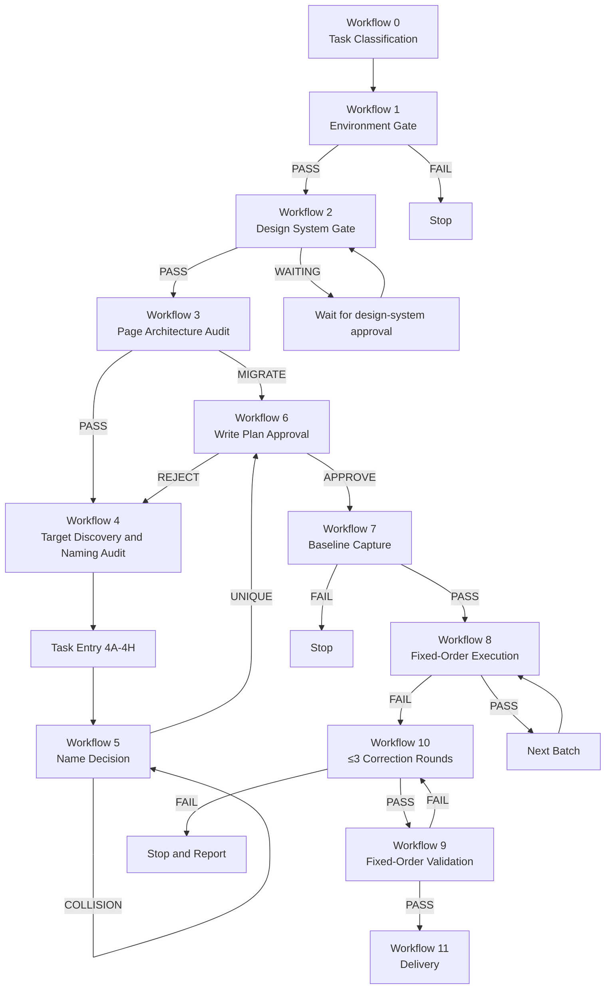
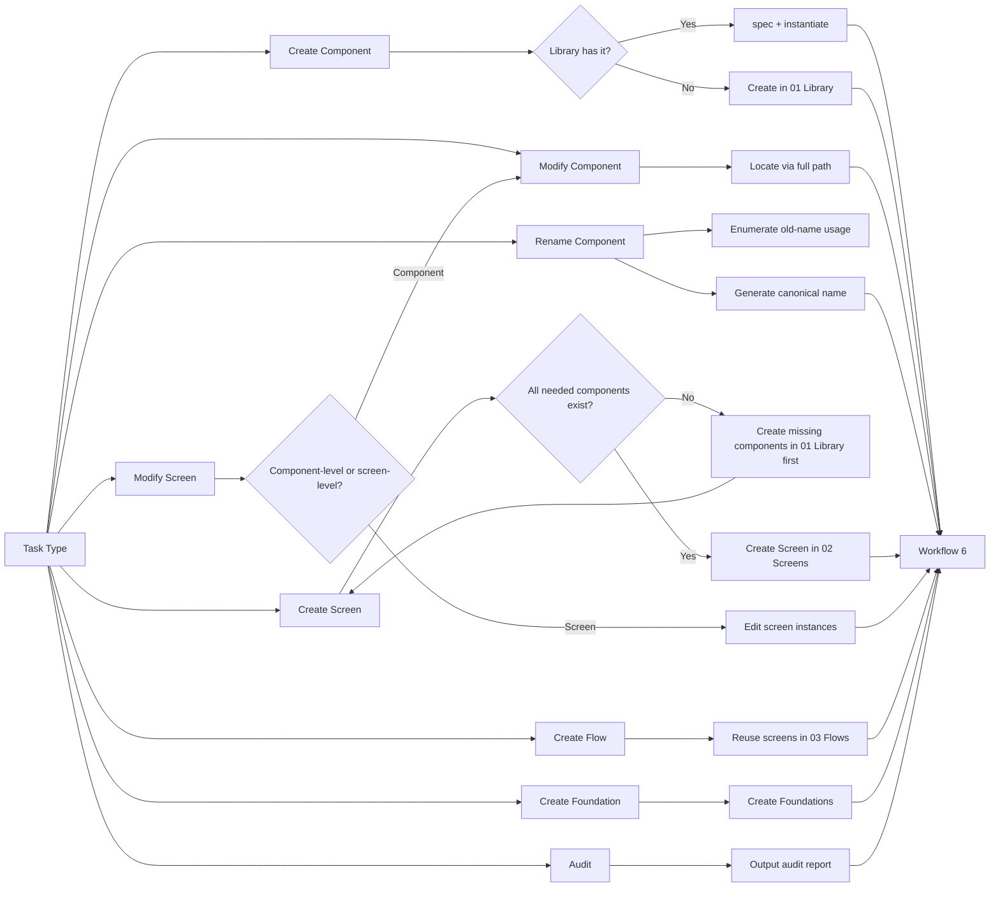
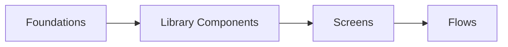
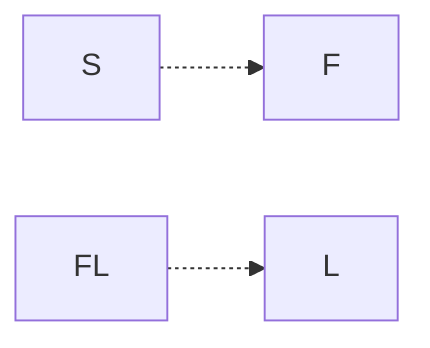
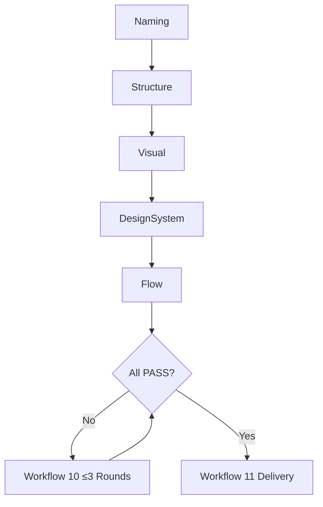
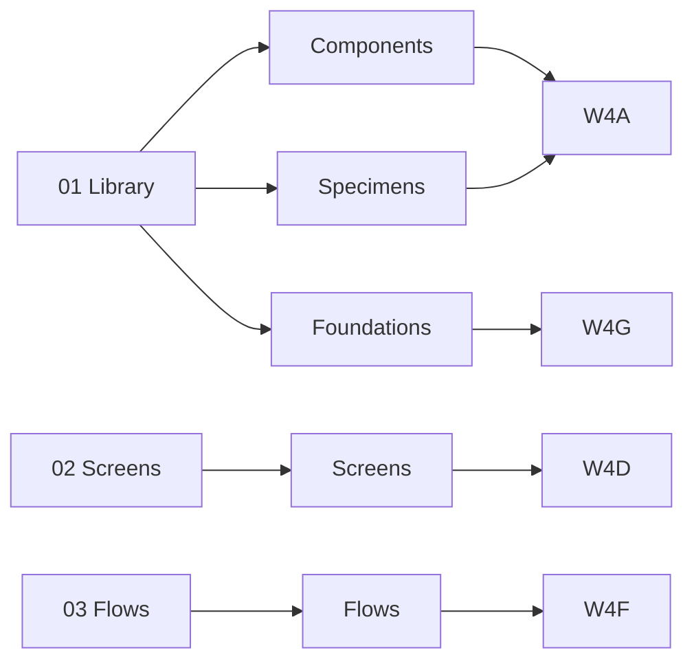

# `figma-skill` Component Naming and Workflow Specification

**Date:** 2026-07-12
**Status:** Awaiting written-spec user review
**Target version:** `figma-skill` 1.1

This spec extends the approved base design at
`docs/superpowers/specs/2026-07-12-figma-cli-workflow-skill-design.md`. It adds:

- The complete component and Screen naming system.
- Variant, Property, and instance naming rules.
- The fixed three-page architecture (free Figma plan).
- The deterministic Workflow 0–11 with task-entry subworkflows 4A–4H.
- The Graph diagrams that `SKILL.md` must contain.

It does not relax any of the global constraints from the base spec.

---

## 1. Naming Language and Path Grammar

- All Figma layer names that participate in `find`, `spec`, or `instantiate` must use English PascalCase.
- The base path grammar is:
  - Component: `<Category>/<Domain>/<Component>[/<Part>...]`
  - Specimen: `Specimen/<Role>`
  - Screen: `Screen/<Platform>/<Domain>/<Flow>/<View>`
  - Flow: `Flow/<Domain>/<Flow>`
- Each path segment must answer "what is this part?" — never "what color, what size, what state, what version".

Forbidden everywhere:

- Non-English characters, spaces, underscores, hyphens.
- Auto-generated names such as `Frame 123`.
- Forbid/Add words: `Common`, `General`, `Misc`, `Other`, `New`, `V2`, `Final`, `Copy`, `New`, `2`.
- Reserved words: `Screen`, `Specimen`, `Flow` used outside their namespaces.

## 2. Fixed Base Categories

`figma-skill` defines a fixed base category list. Project may extend it in
`FIGMA_DESIGN_SYSTEM.md` but may not redefine base categories.

```text
Foundation
Primitive
Action
Input
Navigation
DataDisplay
Feedback
Overlay
Layout
Content
Internal
Deprecated
```

Project-defined categories must:

- Use English PascalCase.
- Describe a business domain (example: `Commerce`, `Workspace`, `Analytics`).
- Be documented in `FIGMA_DESIGN_SYSTEM.md` with purpose and at least one example.
- Not duplicate an existing base category by alias.

## 3. Component Identity

The component's full path expresses only its stable identity. Behavior, platform, and state live in Variant Properties.

### 3.1 Component Path

Examples:

```text
Action/Button
Navigation/Sidebar/Item
DataDisplay/Table/Header/Cell
Commerce/Product/Card/Price
Workspace/Project/Member/Avatar
```

Rules:

- The full path is unique inside the Figma file.
- Different components may share leaf names (`Item`, `Cell`, `Icon`) when their paths differ.
- Path segments must encode stable semantics, never color, size, state, theme, or implementation detail.

### 3.2 Name Collision Resolution

Two components must not use `2`, `Copy`, `New`, `Final` to disambiguate. Apply this rule:

```text
Can the two components be swapped directly in the same layout position with the same responsibilities?
├── yes → One Component Set, distinguish via a Variant Property
└── no  → Two separate components; encode the difference in the path
```

Example for `TitleBar`:

- If both Windows and macOS variants can swap in the same layout:
  ```text
  Window/TitleBar
  Variant Property: Platform = Windows | MacOS
  ```
- If responsibilities differ:
  ```text
  Platform/Windows/Window/TitleBar
  Platform/MacOS/Window/TitleBar
  ```

The CLI must search by the full path. When `find` or `spec` returns more than one candidate, the workflow must require the full path before continuing.

## 4. Variants, Properties, and Instances

Component path = stable identity. All switchable dimensions = Variant Properties.

### 4.1 Standard Variant Axes

| Axis          | Purpose                                |
|---------------|----------------------------------------|
| `Variant`     | Visual / behavioral variant family     |
| `Platform`    | OS or device family                    |
| `Size`        | Height/density variant                 |
| `State`       | Interactive state                      |
| `Validation`  | Field-level validation                 |
| `Selection`   | Selected / unselected                  |
| `Orientation` | Layout orientation                     |
| `Density`     | Compact / regular                      |
| `Theme`       | Light / Dark / High Contrast            |
| `Expanded`    | Boolean expansion state                |
| `Loading`     | Boolean async state                    |

Recommended order when defining a Component Set:

```text
Variant → Platform → Size → State → Validation
→ Selection → Orientation → Density → Theme
→ Boolean properties (Expanded, Loading, …)
```

Property names and values use English PascalCase:

```text
Platform=MacOS
Size=Medium
State=Focused
Validation=Error
Expanded=True
Loading=False
```

### 4.2 Independent Dimensions

Each axis must be independent. Forbidden:

```text
State=PrimaryMediumHoverLoading
State=MacOSDarkInactive
Validation=SelectedErrorDisabled
```

Instead:

```text
Action/Button
Variant=Primary, Size=Medium, State=Hover, Loading=False
```

### 4.3 Standard State Values

```text
State=Default
State=Hover
State=Pressed
State=Focused
State=Disabled
```

Standard `Validation` values:

```text
Validation=Default
Validation=Success
Validation=Warning
Validation=Error
```

Standard `Selection`:

```text
Selection=Selected
Selection=Unselected
```

Booleans use `True` / `False` only.

### 4.4 Variant Explosion Prevention

Never generate the full Cartesian product. Only combinations that are:

- Actually used by the product,
- Required for design review,
- Required for engineering handoff,
- Explicitly listed in `FIGMA_DESIGN_SYSTEM.md`.

For example: prefer binding colors to variables so a single `Theme=Light` set switches via mode, instead of duplicating every variant with `Theme=Dark`.

### 4.5 Component Properties (Other than Variants)

Text, Boolean, Instance Swap, Slot, and Exposed Nested Instance property names follow the same PascalCase rules.

Allowed:

```text
Label
SupportingText
LeadingIcon
TrailingIcon
Avatar
Badge
ShowDivider
Dismissible
ContentSlot
```

Forbidden:

```text
Text1
Icon2
Property3
ShowThing
InstanceSwap
```

### 4.6 Instance Naming

The master component keeps the canonical path:

```text
Navigation/TopBar
```

Page instances must be named by their role on the page, never pretending to be a different canonical component:

```text
PrimaryNavigation
CheckoutNavigation
AccountNavigation
```

The CLI must locate a master by its full path, never by instance name.

## 5. Screens, Flows, and Page Architecture

### 5.1 Screen Identity

Base identity is mandatory:

```text
Screen/<Platform>/<Domain>/<Flow>/<View>
```

Optional controlled dimensions (only added when needed):

```text
/State=<State>
/Viewport=<Viewport>
/Role=<Role>
```

Example:

```text
Screen/Web/Commerce/Checkout/Payment
Screen/Web/Commerce/Checkout/Payment/State=Error
Screen/Web/Commerce/Checkout/Payment/State=Default/Viewport=Mobile
Screen/Web/Workspace/Dashboard/Overview/Role=Admin
```

`State`, `Viewport`, and `Role` are independent axes — same forbidden-multi-value-in-one rule as components.

### 5.2 Standard Screen Axes

```text
State:
  Default, Loading, Empty, Error, Success, Offline, PermissionDenied
  (project-specific: e.g. PaymentDeclined, InventoryUnavailable, SessionExpired)

Viewport:
  Desktop, Laptop, Tablet, Mobile
  (numeric breakpoints live in FIGMA_DESIGN_SYSTEM.md, never in layer names)

Role:
  Admin, Member, Guest, …
```

Forbidden in screen names: `1440`, `375`, `V2`, `Final`, `New`, `Step1`, `Step2`.

### 5.3 Component vs Screen Boundary

Dialogs, drawers, and popovers are components:

```text
Overlay/ConfirmDialog
Overlay/PaymentDrawer
Overlay/AccountPopover
```

A screen that shows a component open is a screen state:

```text
Screen/Web/Commerce/Checkout/Payment/State=ConfirmDialogOpen
```

The master of the dialog lives in `01 Library`; the screen in `02 Screens` consumes it.

### 5.4 Flows

Multiple screens form a flow. Step numbers are forbidden in screen names:

```text
Flow/Commerce/Checkout
├── Screen/Web/Commerce/Checkout/Cart
├── Screen/Web/Commerce/Checkout/Shipping
├── Screen/Web/Commerce/Checkout/Payment
└── Screen/Web/Commerce/Checkout/Confirmation
```

Step order lives in the prototype flow, Section arrangement, or handoff doc — never in the layer name.

### 5.5 Page Architecture (Free Figma plan)

Free Figma allows three pages. They are fixed:

```text
01 Library
02 Screens
03 Flows
```

#### `01 Library` Section Layout

```text
01 Library
├── Section: 00 Foundations
│   ├── Foundation/Color
│   ├── Foundation/Typography
│   ├── Foundation/Spacing
│   ├── Foundation/Grid
│   ├── Foundation/Radius
│   ├── Foundation/Shadow
│   └── Foundation/Icon
├── Section Group: 10 Components
│   ├── Section: Action/Button
│   ├── Section: Input/TextField
│   ├── Section: Navigation/Sidebar
│   ├── Section: DataDisplay/Table
│   └── Section: Overlay/Dialog
├── Section: 80 Internal
└── Section: 90 Deprecated
```

Each component Section contains:

```text
Section: Action/Button
├── Component Set: Action/Button
├── Specimen/StateGallery
├── Specimen/VariantMatrix
├── Specimen/Properties
└── Specimen/Usage
```

#### `02 Screens` Section Layout

```text
02 Screens
├── Section: Authentication
├── Section: Commerce/Checkout
├── Section: Account/Profile
├── Section: Workspace/Dashboard
└── Section: Archive
```

#### `03 Flows` Section Layout

```text
03 Flows
├── Flow/Authentication/SignIn
├── Flow/Commerce/Checkout
└── Flow/Workspace/Onboarding
```

Rules:

- `03 Flows` may place screen instances (or approved duplicates of screen frames) for prototype / handoff; it must never hold authoritative screen masters.
- When components grow too large, do not add a fourth page. Apply Library-side tightening: larger category Sections, consolidated Specimens, `90 Deprecated` cleanup, and CLI search by full path.
- If a single file becomes unmaintainable, split into a new Figma file rather than violate the three-page limit.

## 6. Deterministic Workflow 0–11

The skill's runtime entry point (`SKILL.md`) must define these workflows as a deterministic state machine. Each workflow has fixed **Inputs**, **Actions**, **Output**, **Completion gate**, and **Next state**. The agent must:

- Identify the current state.
- Read the reference for that state.
- Execute only that state's fixed actions.
- Verify the completion gate.
- Move to the single legal next state.

The agent must never ask "what's next?", reorder steps, or skip a state. Pause is allowed only for: pending user approval, missing required information, environment failure, or a substantive scope change.

### 6.1 Workflow Index

| Workflow  | Title                         | Output gate           | Next state on PASS |
|-----------|-------------------------------|-----------------------|--------------------|
| 0         | Task Classification           | `TaskType`, `WriteRequired` | 1 |
| 1         | Workspace and Environment     | `EnvironmentGate=PASS` | 2 |
| 2         | Design System Gate            | `DesignSystemGate=PASS or WAITING_APPROVAL` | 3 |
| 3         | Page Architecture Audit       | `PageArchitectureGate=PASS or NEEDS_MIGRATION` | 4 |
| 4         | Target Discovery + Naming Audit | `DiscoveryGate=PASS` | 4A–4H |
| 4A–4H     | Task Entry (Create/Modify/Rename/Create Screen/Modify Screen/Create Flow/Create Foundation/Audit) | task-specific output | 5 |
| 5         | Name Decision                 | `NameUnique=True` | 6 |
| 6         | Figma Write Plan Approval     | user approval         | 7 |
| 7         | Baseline Capture              | `BaselineGate=PASS` | 8 |
| 8         | Fixed-Order Execution         | `BatchGate=PASS` per batch | next batch, then 9 |
| 9         | Fixed-Order Validation        | `ValidationGate=PASS` | 11, otherwise 10 |
| 10        | At Most Three Correction Rounds | `Round ≤ 3` | 9 or stop+report |
| 11        | Delivery                      | `FinalStatus=PASS or FAILED` | done |

### 6.2 Workflow 0 — Task Classification

Inputs: user request.

Actions: classify into one of:

- `A Create`, `B Modify`, `C Audit`, `D Migrate`, `E Export`.

Output:

```text
TaskType: A | B | C | D | E
Target: <canonical target if known>
ExpectedDeliverable: <component | screen | flow | rename | report | export>
WriteRequired: True | False
```

Next: Workflow 1.

When `WriteRequired=False`, the skill still runs Workflows 1, 2, 3, 4 (read-only), 9, 11 — but Workflows 5, 6, 7, 8, 10 are forbidden.

### 6.3 Workflow 1 — Workspace and Environment

Inputs: classified task.

Actions (fixed):

1. Pin `<Current workspace>` to the session-authorized directory.
2. Run `figma-cli --version` and `figma-cli --help`.
3. If missing, run the Windows installer from GitHub Releases.
4. Run `figma-cli connect` (Yolo by default).
5. Run `figma-cli status`.

Output:

```text
Workspace: <path>
CLI Version: <semver>
Connection: PASS | FAIL
Daemon: <status>
EnvironmentGate: PASS | FAIL
```

Next: PASS → Workflow 2; FAIL → stop, no Figma reads or writes.

### 6.4 Workflow 2 — Design System Gate

Inputs: current task, design-system document path.

Actions:

- If `<Current workspace>/docs/FIGMA_DESIGN_SYSTEM.md` exists and covers the task, extract rules.
- If document exists but lacks required rules, propose minimum supplement and stop for approval.
- If document missing, build minimum draft from user requirements, Figma variables/styles/components, target patterns, and finally professional defaults. Stop for approval.

Output:

```text
DesignSystemPath: <path>
DocumentStatus: Complete | Incomplete | Missing
RulesUsed: …
RulesAdded: …
Conflicts: …
DesignSystemGate: PASS | WAITING_APPROVAL
```

Next: PASS → Workflow 3; WAITING → pause for approval, then return to Workflow 2.

### 6.5 Workflow 3 — Page Architecture Audit

Inputs: open Figma file.

Actions (fixed checks):

1. Pages must be exactly `01 Library`, `02 Screens`, `03 Flows`. A fourth page is a violation.
2. `01 Library` must contain Sections `00 Foundations`, `10 Components`, `80 Internal`, `90 Deprecated`.
3. `02 Screens` must be organized by Domain/Flow sections and may include an `Archive` section.
4. `03 Flows` may contain only flow-specific Section layouts and instances/duplicates of screens.
5. Authoritative component masters live in `01 Library`. Authoritative screen frames live in `02 Screens`.

Output:

```text
Pages: <list>
LibraryStatus: OK | Drift
ScreensStatus: OK | Drift
FlowsStatus: OK | Drift
PageViolations: <list>
PageArchitectureGate: PASS | NEEDS_MIGRATION
```

Next: PASS → Workflow 4. NEEDS_MIGRATION + WriteRequired=True → fold migration into Workflow 6. NEEDS_MIGRATION + WriteRequired=False → record only.

### 6.6 Workflow 4 — Target Discovery and Naming Audit

Inputs: target type and current open file.

Actions:

1. Read target Page, Section, Frame, or Component.
2. Read related variables, styles, components, Component Sets, and reuse handles.
3. Look up candidate components by full canonical path.
4. Check naming for current task scope: full path uniqueness, forbidden words, PascalCase, correct Variant axes.
5. Resolve ambiguity by full path; never guess.

Output:

```text
TargetNodes: <list>
ReusableComponents: <list with full paths>
NamingViolations: <list>
AmbiguousNames: <list>
RenameRequired: True | False
ReuseStrategy: spec+instantiate | ComponentSet | duplicate | render-batch | new
DiscoveryGate: PASS
```

Next: PASS → Workflow 4A–4H.

### 6.7 Workflow 4A — Create Component

Actions (fixed):

1. Search `01 Library` for an existing match (full path).
   - If found → stop; route to reuse decision in Workflow 4.
2. Choose or create the matching Section under `10 Components`.
3. Create the master component or Component Set.
4. Add required Variant Properties.
5. Add specimens:
   - `Specimen/StateGallery`
   - `Specimen/VariantMatrix`
   - `Specimen/Properties`
   - `Specimen/Usage`

Forbidden: creating components in `02 Screens` or `03 Flows`.

### 6.8 Workflow 4B — Modify Component

Actions:

1. Locate component via full canonical path in `01 Library`.
2. Run `spec` to read its full variant and property definition.
3. List every specimen, screen instance, and documentation reference.
4. Estimate impact radius.
5. Continue to Workflow 6.

Forbidden: editing screen instances to alter component appearance directly.

### 6.9 Workflow 4C — Rename Component

Actions:

1. Use the old canonical path to enumerate every instance, specimen, screen usage, doc reference, and external code reference.
2. Generate the new canonical path.
3. Estimate impact.
4. Continue to Workflow 6.

Forbidden: rename only the master; instances and references must be migrated too.

### 6.10 Workflow 4D — Create Screen

Actions:

1. Verify that all components the screen needs already exist in `01 Library`.
   - If missing → create them first via Workflow 4A; then return here.
2. Locate or create the Domain/Flow Section in `02 Screens`.
3. Create the screen Frame with the full `Screen/.../State=/Viewport=/Role=` path.
4. Instantiate required components.
5. Forbidden: storing the screen's component variants inside the screen.

### 6.11 Workflow 4E — Modify Screen

Actions:

1. Locate the screen.
2. Enumerate every component instance and its source.
3. Decide if the change is component-level (route to 4B) or content-level (continue).
4. Continue to Workflow 6.

### 6.12 Workflow 4F — Create Flow

Actions:

1. Verify `02 Screens` contains the required screens.
2. Place screen instances (or approved duplicates) in `03 Flows`.
3. Wire prototype connections.
4. Forbidden: redesigning or relocating authoritative screen masters.

### 6.13 Workflow 4G — Create Foundation

Actions:

1. Update `FIGMA_DESIGN_SYSTEM.md` first.
2. After design-system approval, create Foundations in `01 Library/00 Foundations`.
3. Continue to Workflow 6.

### 6.14 Workflow 4H — Audit

Actions:

1. Read-only checks across Pages, naming, validation.
2. Output report only.
3. Continue directly to Workflow 9 and Workflow 11.

### 6.15 Workflow 5 — Name Decision

Output:

```text
ObjectType: Component | Specimen | Screen | Flow
CanonicalName: <full path>
VariantAxes: <list>
PropertyNames: <list>
NameUnique: True | False
```

If `NameUnique=False` → regenerate with a fuller semantic path (no `2`, `Copy`, `New`, `Final`, `V2`).

### 6.16 Workflow 6 — Figma Write Plan Approval

Fixed template:

```text
TargetFile:
TargetPage:
TargetSection:
TaskBoundary:
Create:
Modify:
Rename:
Reuse:
Instantiate:
Duplicate:
Variables:
Components:
Screens:
Flows:
PageMigration:
NamingMigration:
AffectedDependencies:
OutOfScopeIssues:
CommandPlan:
EvalRunFallback:
BaselinePlan:
ValidationPlan:
```

`EvalRunFallback`, when present, must also contain:

```text
NativeHelpChecked:
MissingNativeCapability:
TargetNodeIds:
FallbackCodeScope:
FallbackImpact:
```

Pause for explicit user approval. Approved → Workflow 7. Rejected → return to Workflow 4. Scope materially changed → re-plan.

Design-system approval never satisfies this gate.

### 6.17 Workflow 7 — Baseline Capture

For existing files:

```text
TargetNodeIds:
Names:
Types:
ParentIds:
PositionAndSize:
AutoLayout:
Constraints:
Bindings:
ReuseHandles:
BaselineScreenshot:
```

For renames add:

```text
OldCanonicalName:
NewCanonicalName:
ExistingInstances:
DocumentationReferences:
ReplacementPath:
```

`BaselineGate: PASS` required before execution.

### 6.18 Workflow 8 — Fixed-Order Execution

Mandatory dependency order across layers:

```text
Foundations → Library Components → Component Variants and Properties → Specimens → Screens → Flows
```

Screens must never precede the components they need.

Each batch (fixed):

```text
read current state
→ execute one smallest related write
→ re-read affected nodes
→ check names, NodeIds, hierarchy, geometry
→ PASS → next batch; FAIL → Workflow 10
```

After any structural change (`duplicate`, `reparent`, `unwrap`, component conversion, variant combination, delete/rebuild), NodeIds and geometry must be re-read.

### 6.19 Workflow 9 — Fixed-Order Validation

Validation layers run in fixed order:

```text
Naming → Structure → Visual → DesignSystem → Flow
```

- Naming: page count, full-path uniqueness, PascalCase, axes/values, specimen naming, deprecated replacement, forbidden words.
- Structure: Page/Section/parent-child, NodeIds, Auto Layout, constraints, instance/source, variable bindings, `spec --check` when applicable.
- Visual: export PNG to `[Current workspace]/temp/figma-screenshot/`, open and inspect.
- DesignSystem: compare against `FIGMA_DESIGN_SYSTEM.md`.
- Flow: confirm screen masters in `02 Screens`, flow artifacts in `03 Flows`, no authoritative masters in `03 Flows`.

Output:

```text
NamingValidation:
StructuralValidation:
VisualValidation:
DesignSystemValidation:
FlowValidation:
ValidationGate: PASS | FAIL
```

### 6.20 Workflow 10 — At Most Three Correction Rounds

```text
Round 1 → Round 2 → Round 3
```

Round 3 still failing → stop writing. Output full failure report. Never run a fourth round.

### 6.21 Workflow 11 — Delivery

Fixed delivery report:

```text
TaskType:
DesignSystemChanges:
PageChanges:
ComponentsCreated:
ComponentsModified:
ComponentsRenamed:
ScreensCreated:
FlowsCreated:
OutOfScopeNamingIssues:
Validation:
- Naming:
- Structure:
- Visual:
- DesignSystem:
- Flow:
ScreenshotPaths:
RemainingIssues:
CorrectionRounds:
FinalStatus: PASS | FAILED
```

Only `FinalStatus=PASS` permits declaring "complete".

## 7. SKILL.md Graph Requirements

`SKILL.md` must include Mermaid graphs for each diagram below. The agent must read these graphs literally — no reinterpretation.

### 7.1 Total Workflow Graph



### 7.2 Task Entry and Reuse Graph



### 7.3 Single-Direction Dependency Graph



Forbidden (must not appear):



### 7.4 Validation Order Graph



### 7.5 Page Architecture Graph



## 8. Reference File Layout

The skill's reference files and their workflow mappings:

| Reference                       | Workflows                |
|---------------------------------|--------------------------|
| `installation.md`               | 1                        |
| `design-system.md`              | 2, 4G                    |
| `discovery-and-planning.md`     | 3, 4, 4A–4H, 5, 6        |
| `naming.md` (new)               | 4, 5, 4C                 |
| `execution.md`                  | 6, 7, 8                  |
| `validation.md`                 | 9, 10, 11                |

`naming.md` must contain the complete naming grammar (Sections 1–5 of this spec) and the collision resolution rule.

## 9. Red Flags — Stop

In addition to the existing red flags in the base spec, add:

- "Skipping `01 Library` lookup — the screen is small enough."
- "Renaming only the master and ignoring instances."
- "Adding a fourth Page to make it tidier."
- "Reusing the screen as a component variant."
- "Asking the user 'what's next?' — the workflow defines the next state."

## 10. Completion Gate (Reaffirmed)

All Workflows 0–11 must complete with `PASS`. Any `FAIL` or `STOP` requires a full failure report and forbids claiming completion. This extends the base spec's completion gate, it does not replace it.

## 11. Spec Self-Review Checklist

- All Workflows 0–11 defined with fixed inputs, actions, outputs, gates, and next states.
- All task-entry subworkflows 4A–4H referenced from a single decision point.
- All forbidden patterns enumerated with explicit "do not" examples.
- All Mermaid graphs present, correct, and self-contained.
- All three reference file mappings (including new `naming.md`) listed.
- All cross-references to the base spec preserved (approval gates, environment rules, etc.).
- Version target for the skill is `1.1` (minor bump from `1.0`).

## 12. Out of Scope (this spec)

- Importing existing third-party design systems (e.g. shadcn UI presets) — handled by separate spec if needed.
- Multi-file Figma project topologies beyond the three-page plan — handled by separate spec.
- Sync of `FIGMA_DESIGN_SYSTEM.md` between workspace and Figma Variables — handled by separate spec.