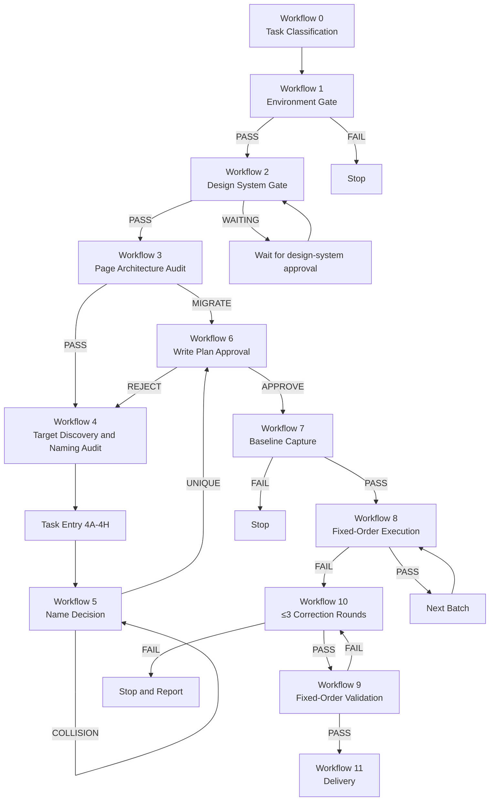
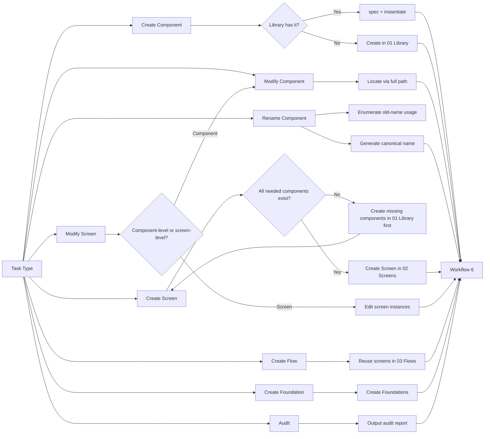
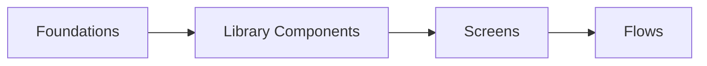
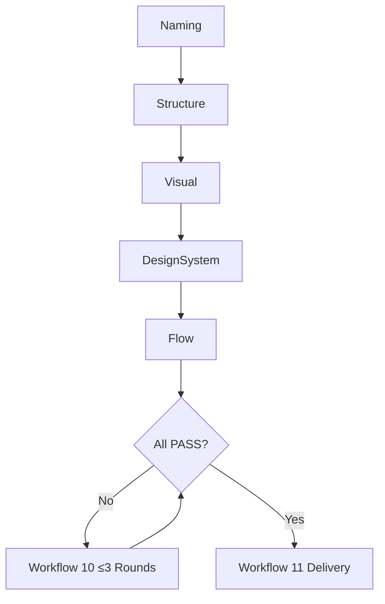
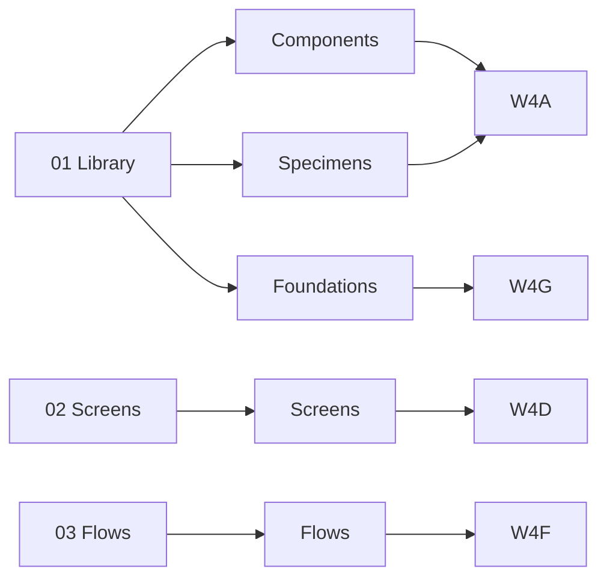

# Figma End-to-End Execution

将用户需求转化为可编辑、可复用、经过实际截图验收的 Figma 产品 UI。覆盖从零创建与修改现有文件。首版聚焦 Web、桌面端、移动端 UI 及设计系统。

## Non-Negotiable Rules

- 所有 Figma 读取、创建、修改、导出和验证必须使用 `figma-cli`。
- 禁止使用 Figma MCP、其他 Figma CLI 或 GUI 自动化作为替代路径。
- 每个新会话首次执行 Figma 任务时，必须先运行 `figma-cli connect`，再运行 `figma-cli status`。
- `<Current workspace>/docs/FIGMA_DESIGN_SYSTEM.md` 是唯一设计规范来源。
- 设计系统审批与 Figma 首次写入审批是两次独立审批；前者禁止被解释为后者。
- 只有当前 CLI 顶层帮助和最接近意图的子命令帮助都证明缺少原生能力，并且用户批准该精确降级时，才允许使用 `eval/run`。
- duplicate、reparent、unwrap、组件化、组合 variants、删除重建或大幅层级调整后，必须重新读取 NodeId 和当前几何。
- 首版禁止创建跨任务持久缓存。任务内上下文禁止替代写入前实时读取。
- 验证失败最多自动修正三轮（≤3）；仍失败必须停止写入并完整报告。
- 硬性要求必须用「必须」「禁止」「只有……才允许」；禁止用弱措辞稀释门禁。

## Naming Grammar

### Component Path

```text
<Category>/<Domain>/<Component>[/<Part>...]
```

完整路径在同一个 Figma 文件中必须唯一。路径只表达稳定身份；禁止使用颜色、尺寸、状态或版本修饰。

固定基础分类：

```text
Foundation
Primitive
Action
Input
Navigation
DataDisplay
Feedback
Overlay
Layout
Content
Internal
Deprecated
```

项目可在 `FIGMA_DESIGN_SYSTEM.md` 增加业务域分类，但必须说明用途并禁止使用 `Common` / `General` / `Misc` / `Other` 等兜底目录。

### Screen Path

```text
Screen/<Platform>/<Domain>/<Flow>/<View>
  /State=<State>
  /Viewport=<Viewport>
  /Role=<Role>
```

示例：

```text
Screen/Web/Commerce/Checkout/Payment
Screen/Web/Commerce/Checkout/Payment/State=Error/Viewport=Mobile
Screen/Web/Workspace/Dashboard/Overview/Role=Admin
```

State、Viewport、Role 之间必须相互独立，禁止把多个维度合并到同一个值。

### Specimen Path

```text
Specimen/StateGallery
Specimen/VariantMatrix
Specimen/Properties
Specimen/Usage
```

### Flow Path

```text
Flow/<Domain>/<Flow>
```

### Collision Resolution

```text
能否在相同位置、以相同职责直接互换？
├── 是 → 同一 Component Set，以独立 Variant Property 区分
└── 否 → 独立组件，以完整语义路径区分
```

### Variant Axes

```text
Variant
Platform
Size
State
Validation
Selection
Orientation
Density
Expanded
Loading
```

标准 State 值：

```text
State=Default
State=Hover
State=Pressed
State=Focused
State=Disabled
```

属性名和值统一英文 PascalCase。布尔属性统一使用 `True` / `False`。

禁止：

```text
State=PrimaryMediumHoverLoading
State=MacOSDarkInactive
Validation=SelectedErrorDisabled
```

### Instance Naming

主组件保持规范完整路径；实例按在页面内的角色命名（例如 `PrimaryNavigation`）。禁止从实例名称猜测主组件来源，CLI 必须按主组件完整路径查找。

## Three-Page Architecture (Free Figma Plan)

```text
01 Library
02 Screens
03 Flows
```

禁止创建第四个 Page。`01 Library` 内部必须按 Section 分区：

```text
01 Library
├── Section: 00 Foundations
├── Section Group: 10 Components
├── Section: 80 Internal
└── Section: 90 Deprecated
```

`02 Screens` 通过业务域和 Flow Section 组织；`03 Flows` 只承载流程编排，不承载权威 Component 或 Screen。

## State Machine

```text
接收需求
→ Workflow 0 任务分类
→ Workflow 1 工作区与环境门禁
→ Workflow 2 设计系统门禁
→ Workflow 3 Figma 文件结构审计
→ Workflow 4 目标发现与命名审计
→ Workflow 4A–4H 任务入口
→ Workflow 5 命名决策
→ Workflow 6 Figma 写入方案审批
→ Workflow 7 记录基线
→ Workflow 8 按固定顺序执行
→ Workflow 9 固定验证顺序
→ Workflow 10 最多三轮修正
→ Workflow 11 交付
```

## Approval Gates

### Gate 1 — Design System

文档缺失或缺少当前任务规则时，必须先提出最小必要规范，说明依据、影响和范围外冲突，并等待明确批准。批准后才允许写入 Markdown。该批准禁止授权任何 Figma 写入。

### Gate 2 — Figma Write

设计系统确定后，必须提交目标范围、复用/创建策略、组件与变量改动、布局与响应式方案、冲突修正范围、基线与批次、`eval/run` 证据、验证标准，并等待明确批准。结构、规范、范围、共享组件或降级方式实质变化时，必须重新审批。

## Workflows 0–11

### Workflow 0 — Task Classification

输出：`TaskType ∈ {A Create, B Modify, C Audit, D Migrate, E Export}`，`WriteRequired: True | False`。完成条件：分类与预期交付物明确；下一状态：Workflow 1。`WriteRequired=False` 时仍执行 1/2/3/4/9/11，禁止进入 5/6/7/8/10。

### Workflow 1 — Workspace and Environment

固定动作：固定 `<Current workspace>`；执行 `figma-cli --version`、`--help`、Windows 安装（必要时）；`connect`；`status`。完成条件：`EnvironmentGate=PASS`。下一状态：PASS → 2；FAIL → 停止。

### Workflow 2 — Design System Gate

固定动作：读取 `<Current workspace>/docs/FIGMA_DESIGN_SYSTEM.md`，按缺失、缺项、完整三分支处理。完成条件：`DesignSystemGate=PASS` 或 `WAITING_APPROVAL`。下一状态：PASS → 3；WAITING → 等待审批后回到 2。

### Workflow 3 — Page Architecture Audit

固定检查：`01 Library` / `02 Screens` / `03 Flows` 三个 Page；`00 Foundations` / `10 Components` / `80 Internal` / `90 Deprecated` Section；权威组件位置；权威 Screen 位置。完成条件：`PageArchitectureGate=PASS` 或 `NEEDS_MIGRATION`。下一状态：PASS → 4；NEEDS_MIGRATION + WriteRequired=True → 并入 Workflow 6；NEEDS_MIGRATION + WriteRequired=False → 仅记录。

### Workflow 4 — Target Discovery and Naming Audit

固定动作：定位 Page/Section/Frame/Component；读取相关 variables、styles、components、Component Sets 和 reuse handles；按完整规范路径查找；歧义时必须补全路径。完成条件：`DiscoveryGate=PASS`。下一状态：PASS → 4A–4H。

### Workflow 4A — Create Component

固定动作：在 `01 Library` 中只读检查是否已有匹配组件；不存在则按 Category 创建 Section；创建主组件或 Component Set；补齐 Variant Property；添加四个 Specimen。完成条件：组件和 Specimen 已就位。下一状态：Workflow 5。

### Workflow 4B — Modify Component

固定动作：通过 `spec` 读取完整定义；列出 specimens、Screen 实例、文档引用；估算影响半径。完成条件：影响半径已记录。下一状态：Workflow 5。

### Workflow 4C — Rename Component

固定动作：用旧名称枚举所有实例、引用、外部代码引用；生成新规范名称；估算影响。完成条件：迁移清单已记录。下一状态：Workflow 5。

### Workflow 4D — Create Screen

固定动作：复核 `01 Library` 是否已有所需组件；缺失则先在 Library 创建再返回；在 `02 Screens` 定位 Section；创建 Screen Frame；实例化所需组件；禁止在 Screen 中另存变体组件。完成条件：Screen 已创建并仅消费 Library 组件。下一状态：Workflow 5。

### Workflow 4E — Modify Screen

固定动作：定位 Screen；列出每个组件实例的来源；判断是组件级改动（→ 4B）还是内容级改动。完成条件：来源分类已记录。下一状态：Workflow 5 或 Workflow 4B。

### Workflow 4F — Create Flow

固定动作：复核 `02 Screens` 齐备；复用 Screen Frame；在 `03 Flows` 摆放或连线；禁止在 Flows 重新设计 Screen 源。完成条件：Flow 已创建。下一状态：Workflow 5。

### Workflow 4G — Create Foundation

固定动作：先更新 `FIGMA_DESIGN_SYSTEM.md`；获批后在 `01 Library/00 Foundations` 创建。完成条件：文档已批准，Foundations 已创建。下一状态：Workflow 5。

### Workflow 4H — Audit

固定动作：只读检查 Pages、命名、验证；输出报告；禁止修改。完成条件：报告已生成。下一状态：Workflow 9。

### Workflow 5 — Name Decision

输出：`ObjectType`、`CanonicalName`、`VariantAxes`、`PropertyNames`、`NameUnique`。`NameUnique=False` 必须重新生成完整语义路径，禁止使用 `2` / `Copy` / `New` / `Final` / `V2`。完成条件：唯一名称。下一状态：Workflow 6。

### Workflow 6 — Figma Write Plan Approval

固定模板：

```text
TargetFile:
TargetPage:
TargetSection:
TaskBoundary:
Create:
Modify:
Rename:
Reuse:
Instantiate:
Duplicate:
Variables:
Components:
Screens:
Flows:
PageMigration:
NamingMigration:
AffectedDependencies:
OutOfScopeIssues:
CommandPlan:
EvalRunFallback:
BaselinePlan:
ValidationPlan:
```

`EvalRunFallback` 必须包含 `NativeHelpChecked`、`MissingNativeCapability`、`TargetNodeIds`、`FallbackCodeScope`、`FallbackImpact`。完成条件：获得用户明确批准。下一状态：批准 → 7；拒绝 → 回到 4；范围实质变化 → 重新审批。

### Workflow 7 — Baseline Capture

记录目标及直接依赖的 NodeId、name、type、parent、位置与尺寸、Auto Layout、约束、绑定、reuse handles、基线截图。重命名任务还需记录旧名称、新名称、已有实例、文档引用、替换路径。完成条件：`BaselineGate=PASS`。下一状态：Workflow 8。

### Workflow 8 — Fixed-Order Execution

固定依赖顺序：`Foundations → Library Components → Variants/Properties → Specimens → Screens → Flows`。Screen 禁止在组件就绪前创建。每批：读 → 写 → 重读 → 检查 → 通过则下一批。结构变化后必须重读 NodeId。完成条件：所有批次 `BatchGate=PASS`。下一状态：完成 → Workflow 9；任一批次失败 → Workflow 10。

### Workflow 9 — Fixed-Order Validation

固定顺序：`Naming → Structure → Visual → DesignSystem → Flow`。Visual 必须实际打开 `<Current workspace>/temp/figma-screenshot/` 中的截图。完成条件：`ValidationGate=PASS`。下一状态：PASS → 11；FAIL → 10。

### Workflow 10 — At Most Three Correction Rounds

最多三轮：定位 → 最小修正 → 重跑受影响验证。第三轮后仍失败必须停止写入，禁止第四轮；输出完整失败报告。完成条件：第三轮内 PASS 或正式失败。下一状态：PASS → 9；失败 → 停止。

### Workflow 11 — Delivery

固定交付报告：

```text
TaskType:
DesignSystemChanges:
PageChanges:
ComponentsCreated:
ComponentsModified:
ComponentsRenamed:
ScreensCreated:
FlowsCreated:
OutOfScopeNamingIssues:
Validation:
- Naming:
- Structure:
- Visual:
- DesignSystem:
- Flow:
ScreenshotPaths:
RemainingIssues:
CorrectionRounds:
FinalStatus: PASS | FAILED
```

只有 `FinalStatus=PASS` 才允许声明完成。

## Diagrams

### Total Workflow Graph



### Task Entry and Reuse Graph



### Single-Direction Dependency Graph



反向路径禁止：`Screens -.-> Foundations`、`Flows -.-> Library Components`。

### Validation Order Graph



### Page Architecture Graph



## Reference Loading

按阶段只读取对应文件：

- 环境检查、Windows 安装、Yolo 连接：`references/installation.md`
- 设计系统文档、缺项、冲突和第一次审批：`references/design-system.md`
- 只读发现、任务内上下文、复用决策和第二次审批：`references/discovery-and-planning.md`
- 已批准写入、命令选择、NodeId、`eval/run` 和恢复：`references/execution.md`
- 三层验收、截图、修正循环与交付：`references/validation.md`

命名规则已写入 `SKILL.md` 本体，不再有独立的 `references/naming.md`。

## Red Flags — Stop

- "MCP 已连接，先用它更快。"
- "用户说不用打扰，所以缺失规范可直接用默认值。"
- "`eval` 仍属于 CLI，不必查原生命令。"
- "duplicate 后旧 ID 通常还能用。"
- "导出成功等于视觉正确。"
- "三轮后再试一次也许就好。"
- "先改 Figma，文档稍后补。"
- "跳过 `01 Library` 检查，Screen 不大。"
- "只重命名主组件，实例不动。"
- "为了整齐新增第四个 Page。"
- "把 Screen 当成组件变体。"
- "下一步该做什么？"——工作流已经定义下一状态。

## Rationalizations Observed in Baseline Tests

| 基线中的合理化 | 强制回应 |
|---|---|
| "MCP 已可用，安装 CLI 增加风险和延误。" | 必须从官方稳定 GitHub Release 安装并验证 `figma-cli`；失败即停止，禁止替代工具。 |
| "用户授权 sensible defaults 且不想被打扰。" | 权威文档缺少当前规则时，必须先补充最小规范并获得独立批准。用户的催促禁止跨越规范门禁。 |

## Completion Gate

只有同时满足以下条件才允许报告完成：

- 批准范围内写入已执行；
- 三层验证全部通过；
- 最终截图已实际打开检查并归档；
- 当前任务符合 `docs/FIGMA_DESIGN_SYSTEM.md`；
- 没有未披露的失败、范围变化或未经批准的降级；
- 三轮修正仍失败时已停止写入并给出完整失败报告；
- 命名与 Workflow 标记全部由确定性测试覆盖并通过。