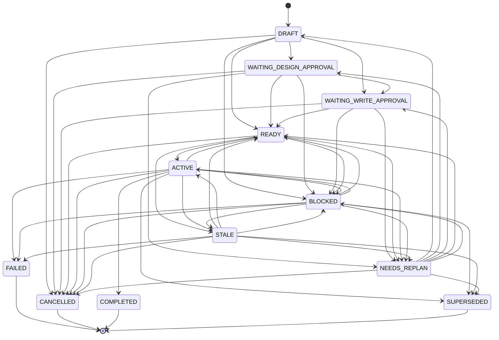

# State, Recovery and Persistent Task Ledger

`.figma/` 是 figma-skill 的跨会话任务账本。它记录 task plan、Todo、checkpoint、events、租约、evidence 与 visual summary。`.figma` 永远不替代 live Figma 读取或当前 `--help` 查询；它的所有结论都必须由最新一次实时读取或会话内 help 输出交叉验证。

## Task Lifecycle

| 任务类型 | 入口 Workflow | 是否需要 Figma 写入 |
| --- | --- | --- |
| `Create` | 0A / 4A | 按情况 |
| `Modify` | 4A–4H | 通常需要 |
| `Audit` | 4I / 9 | 否 |
| `Migrate` | 4A | 通常需要 |
| `Export` | 5 / 11 | 否 |

读取任务只能停留在 `Audit` / `Export`，任何状态变更都不进入 Workflow 6 / 8 / 10 的写入路径。

## Status Machine



`AUDIT` / `EXPORT` 类型只能走 READY → ACTIVE → COMPLETED 的 `readOnly` 子集，禁止进入 `WRITE_REQUIRED_WORKFLOWS = [6, 8, 10]`。

## Lease & Checkpoint

- `lease.json` 字段严格为：`taskId, holder, mode, acquiredAt, heartbeatAt, expiresAt, stateRevision`；`mode` 必须是 `WRITE`。
- 任务每个 task 最多一份有效 WRITE 租约；过期 lease 可被任意 holder 无 takeover 批准回收，但事件详情记录前 holder 与 expiresAt。
- 未经用户批准的 takeover 永远拒绝 `LEASE_HELD`；越权的 takeover 让旧 holder 收到 `LEASE_LOST`。
- `checkpointTask` 顺序：租约校验 → 修订号校验 → 转换校验 → 事件写入 → recovery.md 更新（可选） → state.json → index.json → lease heartbeat。每个步骤都运行在事务边界；任何阶段失败都按 byte-for-byte snapshot 回滚。
- `eventId` 严格 `E-####` 单调递增，从已校验的 events.jsonl 续号。

## Resume and Replan

- `READY -> ACTIVE` 必须从 `BLOCKED / STALE / NEEDS_REPLAN` 出发，且：
  - 从 `STALE` 进入必须由 `STALE_DETECTED` 事件触发；
  - 从 `NEEDS_REPLAN` 出发时必须先落到 `WAITING_DESIGN_APPROVAL` 或 `DRAFT`，不得直接 `ACTIVE`；
- `WAITING_DESIGN_APPROVAL -> ACTIVE` 不存在：必须先拿到设计系统审批。
- 任何重新激活前必须 live revalidate 关键 NodeId 与 geometry；未做 live revalidate 的 checkpoint 会被 validator 拒绝并发出 `LIVE_REVALIDATION_REQUIRED`。

## Screenshot & Visual Findings

- 截图目录固定为 `<project>/.figma/screenshot/<task-id>/`。
- 截图是临时验收材料：每个截图必须实际打开，目视结论必须写入 `state.validation.visual.summary` 或 `final-summary.md`。
- 任务归档时（`archiveStatus` 进入 `ARCHIVED`）只删除本任务的截图目录；其他任务目录保持不动。
- 长期保留的是文本化的视觉结论（页面、节点、视口、问题、修复），不是图片字节。

## Terminal Reclamation

| 状态 | 触发 | 行为 |
| --- | --- | --- |
| `COMPLETED` | Workflow 11 PASS | 摘要生成 + 截图清理 + 关键证据压缩 + lease 删除 |
| `FAILED` | Workflow 11 报告失败 | 同上 + 失败摘要 |
| `CANCELLED` | 用户显式取消 | 同上 |
| `SUPERSEDED` | 新任务替换 | 同上 |
| `BLOCKED` / `STALE` / `NEEDS_REPLAN` | 暂不归档，保留截图以支持恢复 |  |

`archiveStatus` 状态机：`NOT_ARCHIVED → ARCHIVING → ARCHIVED`，失败时设 `ARCHIVE_FAILED` 并保留 lease 以便诊断。`close` 仅在 `ARCHIVED` 之后释放 lease。

## State-and-Recovery Files

```
.figma/
  config.json
  index.json
  README.md
  schemas/
    config.schema.json
    event.schema.json
    index.schema.json
    task-state.schema.json
  tasks/<task-id>/
    state.json
    lease.json
    plan.md
    todo.md
    recovery.md
    events.jsonl
    evidence/manifest.json
  screenshot/<task-id>/
```

`recovery.md` 末段保留 `## Next action`，由 checkpoint 在 resume 为 false 时写入；下一会话可直接读取。